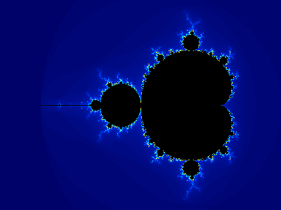

# Mandelbrot Set Visualizer

An interactive Mandelbrot set explorer with precise area-selection zooming, built with Dear PyGUI and optimized for real-time performance.

## What is the Mandelbrot Set?

The Mandelbrot set is one of the most famous fractals in mathematics. It consists of all complex numbers `c` for which the iterative formula:

```
z(n+1) = z(n)² + c
```

Starting with `z(0) = 0`, remains bounded (doesn't escape to infinity) as `n` approaches infinity.

In practice, we test each point by iterating the formula up to a maximum number of iterations. If the magnitude `|z|` exceeds 2, the point will eventually escape to infinity and is not in the Mandelbrot set. Points that don't escape within the maximum iterations are considered part of the set and colored black, while escaping points are colored based on how quickly they escape.

The resulting visualization reveals intricate, self-similar patterns at the boundary between bounded and unbounded regions, with infinite detail available through zooming.


*Classic Mandelbrot set visualization showing the characteristic bulbous main body and circular secondary lobe, with intricate fractal boundaries rendered in the default blue color palette.*

## Features

- **Area Selection Zooming** - Click and drag to select any rectangular region to zoom into
- **Multi-Threaded Performance** - Parallel processing with automatic CPU core detection (2-3x speedup)
- **Configurable Threading** - Choose thread count or force serial mode via command line
- **Real-Time Performance Monitoring** - Live display of render times and pixels/sec
- **Interactive Controls** - Parameter sliders, color schemes, and navigation options  
- **Professional GUI** - Modern Dear PyGUI interface with GPU acceleration
- **Multiple Color Palettes** - Various color schemes to highlight different aspects
- **Progressive Rendering** - Smooth user experience with background computation
- **Save Functionality** - Export current view as high-quality PNG images

## Installation

This project uses `uv` for Python package management. Make sure you have `uv` installed.

### Prerequisites

- Python 3.12 or later
- `uv` package manager

### Setup

```bash
# Clone the repository
git clone <repository-url>
cd mandelbrot

# Install dependencies using uv
uv sync

# Install development dependencies (optional)
uv sync --dev
```

## Usage

### Basic Usage

```bash
# Run the Mandelbrot visualizer
uv run python main.py

# Run with custom window size
uv run python main.py --width 800 --height 600

# Enable debug logging with performance info
uv run python main.py --debug

# Parallel processing options
uv run python main.py --threads 0      # Auto-detect cores (default)
uv run python main.py --threads 1      # Force serial mode
uv run python main.py --threads 4      # Use 4 threads
uv run python main.py --threads 8      # Use 8 threads

# Combined options
uv run python main.py --width 1200 --height 900 --threads 8 --debug
```

### Controls

#### Mouse Controls
- **Click and Drag**: Select a rectangular area to zoom into
- **Small Drag/Click**: Zoom into a specific point (4x magnification)

#### Keyboard Shortcuts
- **R**: Render/Refresh the current view
- **H**: Reset to home view (full Mandelbrot set)
- **O**: Zoom out (2x)
- **B**: Go back in zoom history
- **S**: Save current image as PNG
- **Escape**: Clear selection rectangle

#### GUI Controls
- **Max Iterations Slider**: Adjust computation detail (50-2000 iterations, higher = more detail, slower)
- **Palette Dropdown**: Switch between color schemes (default, hot, cool, grayscale, rainbow)
- **Render Button**: Manually trigger recalculation
- **Reset View**: Return to the complete Mandelbrot set
- **Zoom Out**: Enlarge the current view by 2x
- **Back Button**: Navigate through zoom history
- **Save Image**: Export current view as PNG with custom filename
- **View Info Panel**: Displays current coordinates, processing mode, thread count, and performance metrics

## Performance

### Multi-Threading Benefits

The visualizer uses Numba's parallel processing capabilities to leverage multiple CPU cores:

- **Automatic Core Detection**: Detects and uses all available CPU cores by default
- **Configurable Threading**: Override with `--threads N` for specific core counts
- **Performance Scaling**: Typical 2-3x speedup on quad-core+ systems
- **Real-Time Monitoring**: Live performance metrics in the GUI

### Benchmarking Results

Typical performance on a 12-core system:

| Configuration | Small (400×300) | Medium (800×600) | Large (1200×900) |
|---------------|-----------------|------------------|------------------|
| Serial (1 thread) | 9.1M pixels/sec | 5.4M pixels/sec | 2.5M pixels/sec |
| Parallel (4 threads) | 12.2M pixels/sec | 10.5M pixels/sec | 4.6M pixels/sec |
| Parallel (8 threads) | 17.7M pixels/sec | 11.5M pixels/sec | 5.7M pixels/sec |

### Performance Tools

```bash
# Run performance benchmarks
python benchmark_simple.py

# Test different thread counts
BENCH_THREADS=1 python benchmark_simple.py  # Serial
BENCH_THREADS=4 python benchmark_simple.py  # 4 threads
BENCH_THREADS=8 python benchmark_simple.py  # 8 threads

# Verify correctness of parallel implementation
python test_parallel_correctness.py
```

## Development

### Project Structure

```
mandelbrot/
├── src/
│   ├── mandelbrot_core.py      # Core mathematical functions
│   ├── color_mapping.py        # RGB color palette system
│   ├── coordinate_transforms.py # Pixel-to-complex coordinate mapping
│   ├── mandelbrot_gui.py       # Dear PyGUI interface
│   └── logger_config.py        # Logging configuration
├── tests/                      # Comprehensive test suite
├── main.py                     # Application entry point
└── pyproject.toml             # Project configuration
```

### Running Tests

```bash
# Run the complete test suite
uv run pytest

# Run tests with verbose output
uv run pytest -v

# Run specific test file
uv run pytest tests/test_mandelbrot_core.py
```

### Development Workflow

This project follows Test-Driven Development (TDD) principles:

1. **Tests First**: All functionality is driven by comprehensive tests
2. **Modular Design**: Clear separation between mathematical engine, GUI, and utilities
3. **Performance Focus**: Numba optimization for computationally intensive operations
4. **Professional UX**: Responsive interface with progress feedback

## Technical Details

### Mathematical Engine
- **Multi-Threaded Processing**: Numba parallel execution with `prange()` and `nogil=True`
- **Automatic Fallback**: Graceful degradation from parallel to serial mode
- **JIT Compilation**: High-performance computation with Numba optimization
- **Vectorized Operations**: Efficient NumPy array processing
- **Coordinate System**: Precise mapping between pixel and complex coordinates
- **Escape Time Algorithm**: Optimized iteration counting with configurable limits (50-2000 iterations)

### GUI Architecture
- **Dear PyGUI**: Modern, GPU-accelerated interface framework
- **Texture Rendering**: Efficient image display with real-time updates
- **Performance Monitoring**: Live thread count, render time, and pixels/sec display
- **Background Processing**: Non-blocking calculations with progress indicators
- **Event System**: Responsive mouse and keyboard interaction handling
- **Image Export**: High-quality PNG saving with custom filenames

### Color System
- **Multiple Palettes**: 5 built-in color schemes (default, hot, cool, grayscale, rainbow)
- **Smooth Gradients**: Continuous color transitions based on escape time
- **RGB Mapping**: Efficient conversion from iteration counts to visual representation

## Contributing

1. Fork the repository
2. Create a feature branch (`git checkout -b feature/amazing-feature`)
3. Write tests for your changes
4. Implement your feature following the existing patterns
5. Ensure all tests pass (`uv run pytest`)
6. Commit your changes (`git commit -m 'Add amazing feature'`)
7. Push to the branch (`git push origin feature/amazing-feature`)
8. Open a Pull Request

## License

This project is open source and available under the MIT License.

## Acknowledgments

- The mathematical foundations are based on Benoit Mandelbrot's groundbreaking work on fractal geometry
- Built with Dear PyGUI for modern, performant GUI development
- Uses Numba for high-performance numerical computing
- Color palette inspiration from various mathematical visualization tools
- Developed through collaborative guidance and implementation with Claude Code, incorporating user feedback and requirements throughout the development process
